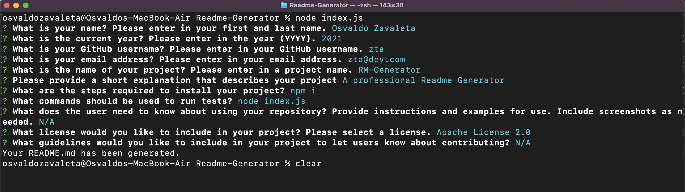

# Readme-Generator
Node.js: Professional README Generator
## Description

This project was designed to allow users to create a high quality README for their app. You can quickly and easily create a README file by using a command-line application to generate one. This allows the project creator to devote more time to working on their project.
## Links

Repository Link: https://github.com/zavaletaosv/Readme-Generator 

Video Link: https://drive.google.com/file/d/1TZuF8wZxMa1XBemuxCfDMl6M_860kz7k/view
## Usage

Once deployed, the application appears as the image attached below on a traditional desktop.

## Credits

Collaborations of this project include the instructional staff, TAs, and fellow classmates in the Rice University Coding Bootcamp 2021 Cohort.

## Licenses

Copyright (c) [2021] [Osvaldo Zavaleta]

Permission is hereby granted, free of charge, to any person obtaining a copy of this software and associated documentation files (the "Software"), to deal in the Software without restriction, including without limitation the rights to use, copy, modify, merge, publish, distribute, sublicense, and/or sell copies of the Software, and to permit persons to whom the Software is furnished to do so, subject to the following conditions:

The above copyright notice and this permission notice shall be included in all copies or substantial portions of the Software.

THE SOFTWARE IS PROVIDED "AS IS", WITHOUT WARRANTY OF ANY KIND, EXPRESS OR IMPLIED, INCLUDING BUT NOT LIMITED TO THE WARRANTIES OF MERCHANTABILITY, FITNESS FOR A PARTICULAR PURPOSE AND NONINFRINGEMENT. IN NO EVENT SHALL THE AUTHORS OR COPYRIGHT HOLDERS BE LIABLE FOR ANY CLAIM, DAMAGES OR OTHER LIABILITY, WHETHER IN AN ACTION OF CONTRACT, TORT OR OTHERWISE, ARISING FROM, OUT OF OR IN CONNECTION WITH THE SOFTWARE OR THE USE OR OTHER DEALINGS IN THE SOFTWARE.